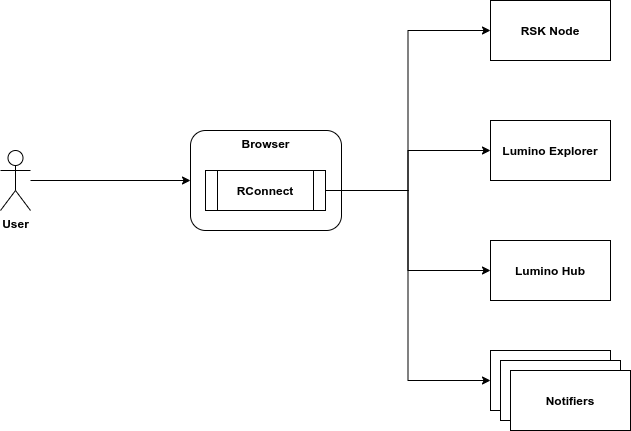

## How to configure RIF Services for local development.

When you run RConnect on Regtest with a local node you need to set up all the 
neccesary infrastructure to allow the wallet to work with RIF Services. 
To do so you need to configure some API parameters that allow
us to access those services.

Take a look at the RConnect General Architecture Diagram:



There we have 1 RSK Node, 1 Lumino Explorer, 1 Lumino Hub and several Notifiers.
All these are running APIs, so we need to specify where they are in order to let the wallet access them.

The file that let us configure this is [this one.](../app/scripts/controllers/rif/configuration/index.js)
There we will see that is a JS file with some functions inside, basically what we need
to change is the function `getInitialConfigStructure` that makes the initial setup.
This function looks similar to this:

```js
  getInitialConfigStructure (chainId) {
    // ... some other code
      case global.networks.reg: // RSK Regtest
        return {
          lumino: {
            explorer: {
              endpoint: '',
            },
          },
          notifier: {
            availableNodes: [],
          },
          rns: {
            contracts: {
              rns: '',
              publicResolver: '',
              multiChainResolver: '',
              rif: '',
              fifsAddrRegistrar: '',
              rskOwner: '',
            },
          },
        };
    }
  }
```
**Note: We only show the important piece of code here.**

As you can see we have a structure like this:

```json5
{
  lumino: {
    explorer: {
      endpoint: '',
    },
  },
  notifier: {
    availableNodes: [],
  },
  rns: {
    contracts: {
      rns: '',
      publicResolver: '',
      multiChainResolver: '',
      rif: '',
      fifsAddrRegistrar: '',
      rskOwner: '',
    },
  },
}
```

Now we need to fill those empty fields, here is some reference about what
those fields are:

```json5
{
  lumino: {
    explorer: {
      endpoint: 'Here you need to put the endpoint url where the Lumino Explorer API is running, for example http://localhost:8080/api/v1',
    },
  },
  notifier: {
    availableNodes: [
      // This is an array of notifier endpoints, you need at least 3.
      'The endpoint for the notifier 1 (where the API is running), for example: http://localhost:8081/',
      'The endpoint for the notifier 2 (where the API is running), for example: http://localhost:8082/',
      'The endpoint for the notifier 3 (where the API is running), for example: http://localhost:8083/'
    ],
  },
  rns: {
    contracts: {
      // All these values can be retrieved from the RNS Suite deployment summary.
      rns: 'The RNS Contract Address',
      publicResolver: 'The Public Resolver Contract Address',
      multiChainResolver: 'The Multi-chain Resolver Contract Address',
      rif: 'The RIF Token Address',
      fifsAddrRegistrar: 'The FIFSAddrRegistrar Contract Address',
      rskOwner: 'The RSK Owner Contract Address',
    },
  },
}
```

As you can see we need to setup some endpoints (for Lumino Explorer and Notifiers) and then the RNS Suite Contract Addresses.
Lumino Hub doesn't need to be here since Lumino Explorer provide that for us in runtime so we are ok.

Here is an example of a local configuration:

```json5
{
  lumino: {
    explorer: {
      endpoint: 'http://localhost:8080/api/v1',
    },
  },
  notifier: {
    availableNodes: [
      'http://localhost:8081/',
      'http://localhost:8082/',
      'http://localhost:8083/',
    ],
  },
  rns: {
    contracts: {
      rns: '0x83C5541A6c8D2dBAD642f385d8d06Ca9B6C731ee',
      publicResolver: '0xE0825f57Dd05Ef62FF731c27222A86E104CC4Cad',
      multiChainResolver: '0x73ec81da0C72DD112e06c09A6ec03B5544d26F05',
      rif: '0x1Af2844A588759D0DE58abD568ADD96BB8B3B6D8',
      fifsAddrRegistrar: '0x8921BF2f074b5470c02Cc7473F17282576111591',
      rskOwner: '0x79bbC6403708C6578B0896bF1d1a91D2BB2AAa1c',
    },
  },
}
```

**IMPORTANT: These parameters are only initial parameters, the wallet needs to be
re-installed (removed and installed again) on the browser after we change this, otherwise we will not see any change at all.**
